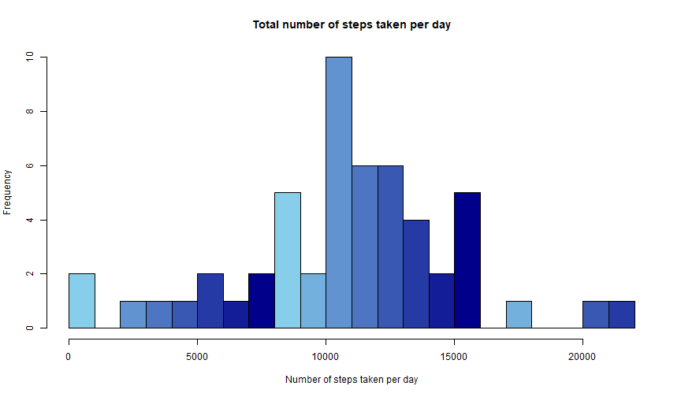
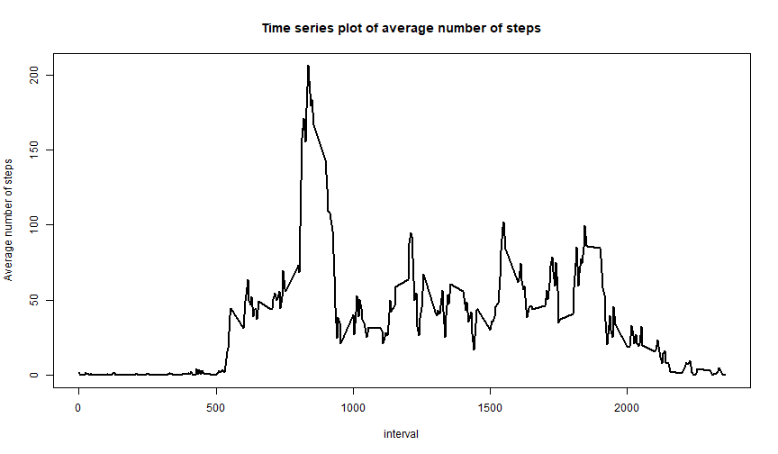
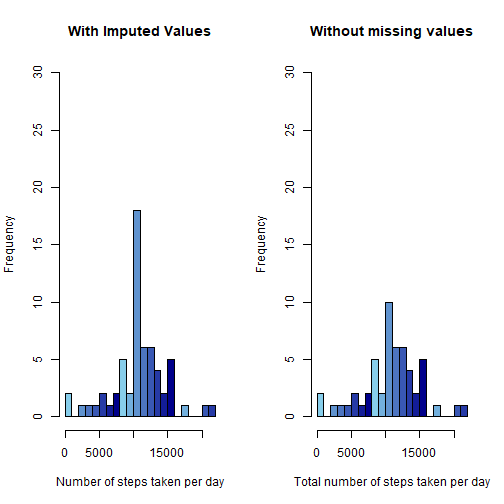
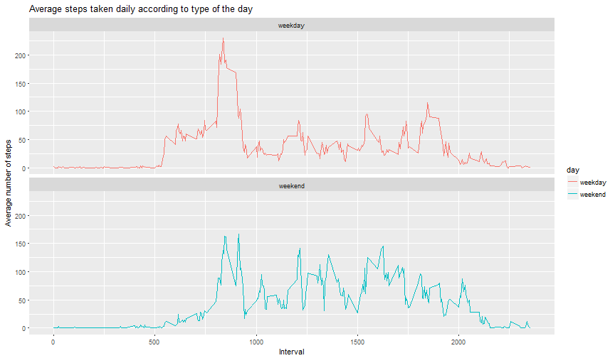

#INTRODUCTION:

It is now possible to collect a large amount of data about personal movement using activity monitoring devices such as a Fitbit, Nike Fuelband, or Jawbone Up. These type of devices are part of the "quantified self" movement - a group of enthusiasts who take measurements about themselves regularly to improve their health, to find patterns in their behavior, or because they are tech geeks. But these data remain under-utilized both because the raw data are hard to obtain and there is a lack of statistical methods and software for processing and interpreting the data.

This assignment makes use of data from a personal activity monitoring device. This device collects data at 5 minute intervals through out the day. The data consists of two months of data from an anonymous individual collected during the months of October and November, 2012 and include the number of steps taken in 5 minute intervals each day.

The data for this assignment can be downloaded from the course web site:

Dataset: Activity monitoring data
The variables included in this dataset are:

steps: Number of steps taking in a 5-minute interval (missing values are coded as NA.
date: The date on which the measurement was taken in YYYY-MM-DD format
interval: Identifier for the 5-minute interval in which measurement was taken
The dataset is stored in a comma-separated-value (CSV) file and there are a total of 17,568 observations in this dataset.


#Assignment Questions:

1) Code for reading in the dataset and/or processing the data.
2) Histogram of the total number of steps taken each day.
3) Mean and median number of steps taken each day.
4) Time series plot of the average number of steps taken.
5) The 5-minute interval that, on average, contains the maximum number of steps.
6) Code to describe and show a strategy for imputing missing data.
7) Histogram of the total number of steps taken each day after missing values are imputed.
8) Panel plot comparing the average number of steps taken per 5-minute interval across weekdays and weekends.
9) All of the R code needed to reproduce the results (numbers, plots, etc.) in the report.

=============================================================================================================

#PART 1 - Loading and Pre-processing the data:

=============================================================================================================

##1) Loading the data:

```r
Activity <- read.csv("activity.csv")
dim(Activity)
```

```
## [1] 17568     3
```

```r
str(Activity)
```

```
## 'data.frame':	17568 obs. of  3 variables:
##  $ steps   : int  NA NA NA NA NA NA NA NA NA NA ...
##  $ date    : Factor w/ 61 levels "2012-10-01","2012-10-02",..: 1 1 1 1 1 1 1 1 1 1 ...
##  $ interval: int  0 5 10 15 20 25 30 35 40 45 ...
```

```r
summary(Activity)
```

```
##      steps                date          interval     
##  Min.   :  0.00   2012-10-01:  288   Min.   :   0.0  
##  1st Qu.:  0.00   2012-10-02:  288   1st Qu.: 588.8  
##  Median :  0.00   2012-10-03:  288   Median :1177.5  
##  Mean   : 37.38   2012-10-04:  288   Mean   :1177.5  
##  3rd Qu.: 12.00   2012-10-05:  288   3rd Qu.:1766.2  
##  Max.   :806.00   2012-10-06:  288   Max.   :2355.0  
##  NA's   :2304     (Other)   :15840
```

##2) Pre-processing the data:

Converting the Date column to POSIXCT using lubridate package


```r
library(lubridate)
Activity$date <- ymd(Activity$date)
str(Activity)
```

```
## 'data.frame':	17568 obs. of  3 variables:
##  $ steps   : int  NA NA NA NA NA NA NA NA NA NA ...
##  $ date    : Date, format: "2012-10-01" "2012-10-01" ...
##  $ interval: int  0 5 10 15 20 25 30 35 40 45 ...
```

================================================================================================================

#PART 2 - What is mean total number of steps taken per day:

================================================================================================================

When missing values were ignored-

##1) Calculating the total number of steps taken per day:


```r
total_steps_perday <- aggregate(steps~date, data=Activity, sum, na.rm = TRUE)
```

##2) Histogram of total number of steps taken per day:


```r
bluepalette <- colorRampPalette(c("skyblue", "darkblue"))
hist(total_steps_perday$steps, main = "Total number of steps taken per day", xlab = "Number of steps taken per day", col=bluepalette(8), breaks=20)
```




##3) Mean and Median of the total number of steps taken per day:


```r
mean(total_steps_perday$steps)
```

```
## [1] 10766.19
```

```r
median(total_steps_perday$steps)
```

```
## [1] 10765
```

==================================================================================================================

#PART 3 - What is the average daily activity pattern?

==================================================================================================================

##1) Time series plot of the 5-minute interval and the average number of steps taken, averaged across all the days:


```r
avg_steps <- aggregate(Activity$steps, by=list(Activity$interval), mean, na.rm = TRUE)
names(avg_steps) <- c("interval", "mean")
plot(avg_steps$interval, avg_steps$mean, type ="l", col = "black", lwd=2, xlab="interval", ylab="Average number of steps", main = "Time series plot of average number of steps")
```




##2) The 5-minute interval which on average across all the days, has maximum number of steps:


```r
avg_steps[which.max(avg_steps$mean), ]$interval
```

```
## [1] 835
```

==================================================================================================================

#PART 4- Imputing missing values:

==================================================================================================================

##1) Total number of missing values:

Firstly checking which columns contain NA values.


```r
any(is.na(Activity$steps))
```

```
## [1] TRUE
```

```r
any(is.na(Activity$date))
```

```
## [1] FALSE
```

```r
any(is.na(Activity$interval))
```

```
## [1] FALSE
```

After learning that only "steps" column has missing values, Finding the number of missing values in that column:


```r
sum(is.na(Activity$steps))
```

```
## [1] 2304
```

Proportion of missing values:


```r
sum(is.na(Activity$steps)) / nrow(Activity)
```

```
## [1] 0.1311475
```

##2) Imputing NA values with the mean of each day:


```r
Imputed_steps <- avg_steps$mean[match(Activity$interval, avg_steps$interval)] 
```

##3) Creating the new dataset which is similar to the original dataset but the missing values are imputed with mean:


```r
Imputed_Activity <- transform(Activity, steps = ifelse(is.na(Activity$steps), yes = Imputed_steps, no = Activity$steps))
```

##4) Histogram of total number of steps taken each day:


```r
Total_steps_imputed <- aggregate(steps ~ date, Imputed_Activity, sum)
names(Total_steps_imputed) <- c("date", "sum_daily_steps")
```


```r
par(mfrow = c(1,2))

hist(Total_steps_imputed$sum_daily_steps, main = "With Imputed Values", xlab = "Number of steps taken per day", col=bluepalette(8), breaks=20, ylim=c(0,30))

hist(total_steps_perday$steps, main = "Without missing values", xlab = "Total number of steps taken per day", col=bluepalette(8), breaks=20, ylim = c(0,30))
```




## Mean & Median in the imputed datset:


```r
mean(Total_steps_imputed$sum_daily_steps)
```

```
## [1] 10766.19
```

```r
median(Total_steps_imputed$sum_daily_steps)
```

```
## [1] 10766.19
```

When compared the values of both the datsets are almost similar but the median of the imputed dataset is slightly higher when compared to the original dataset. This is due to the use of averaging functions to impute NA values. 

=====================================================================================================================

#PART 5 - Differences between activities during weekdays and weekends:

=====================================================================================================================

##1) Creating a new factor variable with two levels to determine whether it is a weekday or weekend:


```r
Imputed_Activity$date <- as.Date(Imputed_Activity$date, format = "%Y-%m-%d")

Imputed_Activity$day <- factor(format(Imputed_Activity$date, "%A"))
levels(Imputed_Activity$day) <- list(weekday = c("Monday", "Tuesday", "Wednesday", "Thursday", "Friday"), weekend = c("Saturday", "Sunday"))
```


##2) Panel plot with time series plots of the 5-minute interval and the average number of steps taken, averaged across all the days:


```r
library(ggplot2)

Activity_day <- aggregate(steps ~ interval + day, Imputed_Activity, mean)

Time_series <- ggplot(Activity_day, aes(x = interval, y = steps, color = day)) + geom_line() + labs(title = "Average steps taken daily according to type of the day", x = "Interval", y= "Average number of steps") + facet_wrap(~day, ncol = 1, nrow = 2)
print(Time_series)
```




```r
library(knitr)
knit("PA1_template.Rmd")
```

```
## 
## 
## processing file: PA1_template.Rmd
```

```
## Error in parse_block(g[-1], g[1], params.src): duplicate label 'date_conversion'
```


